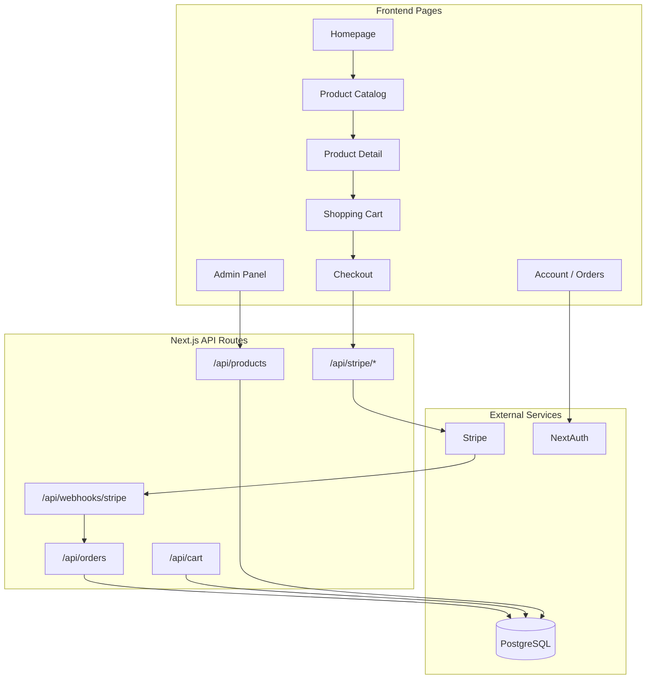

# Electronics E-Commerce Website Plan

## Goal

Create a modern electronics store (phones, laptops, tablets, headphones, accessories) with browsing, cart, user accounts, Stripe checkout, and order management.

## Recommended Stack

| Layer | Choice | Why |
|-------|--------|-----|
| Framework | **Next.js 15** (App Router) | SSR, API routes, production-ready |
| Language | **TypeScript** | Type safety for products, orders, payments |
| Styling | **Tailwind CSS + shadcn/ui** | Clean, responsive UI with reusable components |
| Database | **PostgreSQL + Prisma** | Relational data for products, users, orders |
| Auth | **NextAuth.js (Auth.js v5)** | Login, register, session management |
| Payments | **Stripe Checkout** | Secure card payments, webhooks for order confirmation |
| Images | **Next.js Image + `/public` or Cloudinary** | Product photos (seed with placeholder images initially) |

## Architecture



## Project Structure

```
c:\Users\gg990\E commace\
├── prisma/
│   └── schema.prisma          # User, Product, Category, Cart, Order models
├── src/
│   ├── app/
│   │   ├── page.tsx           # Homepage (hero, featured products, categories)
│   │   ├── products/
│   │   │   ├── page.tsx       # Product listing + filters
│   │   │   └── [slug]/page.tsx
│   │   ├── cart/page.tsx
│   │   ├── checkout/
│   │   │   ├── page.tsx
│   │   │   └── success/page.tsx
│   │   ├── account/
│   │   │   ├── page.tsx       # Profile
│   │   │   └── orders/page.tsx
│   │   ├── admin/
│   │   │   ├── page.tsx       # Dashboard
│   │   │   ├── products/page.tsx
│   │   │   └── orders/page.tsx
│   │   ├── login/page.tsx
│   │   ├── register/page.tsx
│   │   └── api/               # REST + Stripe webhook routes
│   ├── components/
│   │   ├── layout/            # Header, Footer, Navbar (cart badge)
│   │   ├── products/          # ProductCard, ProductGrid, Filters, SpecsTable
│   │   ├── cart/              # CartItem, CartSummary
│   │   └── ui/                # shadcn buttons, inputs, dialogs
│   └── lib/
│       ├── prisma.ts
│       ├── auth.ts
│       └── stripe.ts
├── .env.example
├── package.json
└── README.md
```

## Database Schema (Prisma)

Core models:

- **User** — id, name, email, password hash, role (`USER` | `ADMIN`)
- **Category** — id, name, slug (e.g. `phones`, `laptops`, `accessories`)
- **Product** — id, name, slug, description, price, stock, images[], specs (JSON), categoryId
- **CartItem** — userId, productId, quantity
- **Order** — id, userId, total, status (`PENDING` | `PAID` | `SHIPPED` | `DELIVERED`), stripeSessionId
- **OrderItem** — orderId, productId, quantity, priceAtPurchase

## Key Features by Page

### 1. Homepage
- Hero banner ("Shop the latest electronics")
- Category shortcuts (Phones, Laptops, Tablets, Audio, Accessories)
- Featured / best-selling products grid
- Trust badges (free shipping, secure checkout)

### 2. Product Catalog (`/products`)
- Grid of product cards (image, name, price, rating placeholder)
- Sidebar filters: category, price range, in-stock only
- Search by name
- Sort: price low/high, newest

### 3. Product Detail (`/products/[slug]`)
- Image gallery, price, stock status
- **Specs table** (RAM, storage, battery, etc. — stored as JSON per product)
- Add to cart (quantity selector)
- Related products in same category

### 4. Shopping Cart (`/cart`)
- Line items with quantity update and remove
- Subtotal, estimated tax, total
- "Proceed to Checkout" (requires login)

### 5. Checkout + Stripe
- Shipping address form
- Redirect to **Stripe Checkout Session** (handles card entry securely)
- Webhook at `/api/webhooks/stripe` marks order as `PAID` and decrements stock
- Success page shows order confirmation

### 6. User Account
- Register / login (email + password via NextAuth credentials provider)
- Order history with status and items
- Profile edit (name, address)

### 7. Admin Panel (`/admin`, role-guarded)
- CRUD products (name, price, stock, category, specs, images)
- View and update order status
- Simple dashboard: total orders, revenue, low-stock alerts

## Seed Data

Pre-populate ~12–15 sample electronics products across categories:

- iPhone 15 Pro, Samsung Galaxy S24
- MacBook Air M3, Dell XPS 15
- iPad Air, Samsung Tab S9
- Sony WH-1000XM5, AirPods Pro
- USB-C hub, wireless charger, phone case

Each with realistic prices, specs JSON, and placeholder product images.

## Environment Variables (`.env`)

```
DATABASE_URL=postgresql://...
NEXTAUTH_SECRET=...
NEXTAUTH_URL=http://localhost:3000
STRIPE_SECRET_KEY=sk_test_...
STRIPE_WEBHOOK_SECRET=whsec_...
NEXT_PUBLIC_STRIPE_PUBLISHABLE_KEY=pk_test_...
```

User will need free accounts: **Neon/Supabase** (PostgreSQL), **Stripe** (test mode).

## Implementation Phases

### Phase 1 — Scaffold and Foundation
- `npx create-next-app@latest` with TypeScript, Tailwind, App Router
- Install Prisma, NextAuth, Stripe, shadcn/ui
- Define schema, run migrations, seed sample products
- Build layout (header with nav + cart icon, footer)

### Phase 2 — Product Experience
- Homepage, catalog with filters/search, product detail with specs
- ProductCard and ProductGrid components
- Responsive design (mobile-first)

### Phase 3 — Cart and Auth
- Cart API (add/update/remove items, persist per user)
- Register, login, logout pages
- Protect checkout and account routes

### Phase 4 — Stripe Checkout
- Create Stripe Checkout Session from cart
- Webhook handler for `checkout.session.completed`
- Order creation, stock decrement, success page

### Phase 5 — Account and Admin
- Order history page
- Admin product CRUD and order management
- Role-based access (`ADMIN` only for `/admin`)

### Phase 6 — Polish
- Loading states, error handling, empty cart message
- README with setup steps (DB, Stripe CLI for webhooks locally)
- Final UI polish and accessibility basics

## Design Direction

- Dark header, clean white/gray product pages
- Accent color: electric blue (`#2563eb`) — fits electronics branding
- Card-based product layout, large product images on detail page
- Mobile-responsive navigation with hamburger menu

## What You Will Need to Provide

Before payments work locally:
1. **PostgreSQL database URL** (Neon free tier recommended — no local install needed)
2. **Stripe test API keys** from [dashboard.stripe.com](https://dashboard.stripe.com)
3. **Stripe CLI** for local webhook testing (`stripe listen --forward-to localhost:3000/api/webhooks/stripe`)

## Out of Scope (v1)

- PayPal (can add later alongside Stripe)
- Product reviews/ratings (placeholder stars only)
- Email notifications (order confirmation emails)
- Multi-currency / international shipping
- Deployment (Vercel setup can be a follow-up)
